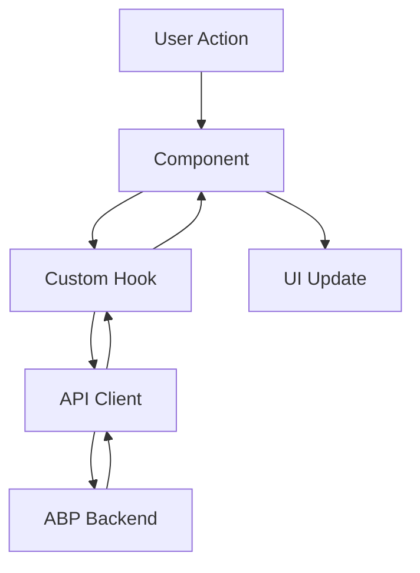
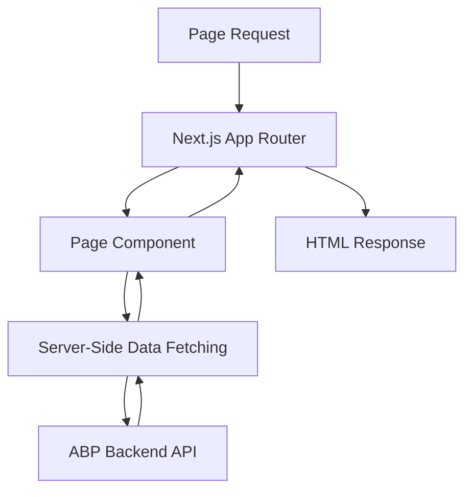
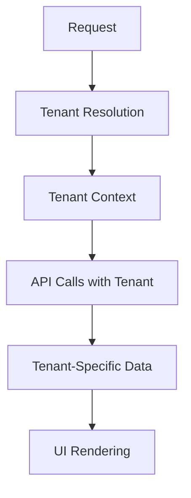

# Architecture Overview

ABP React is built on a modern, scalable architecture that leverages the power of Next.js, TypeScript, and the ABP Framework. This document provides a comprehensive overview of the system architecture and how different components work together.

## 🏗️ System Architecture

### High-Level Overview

ABP React follows a layered architecture pattern with clear separation of concerns:

```
┌─────────────────────────────────────────────────────────────┐
│                    Presentation Layer                       │
│  ┌─────────────┐  ┌─────────────┐  ┌─────────────┐        │
│  │   Pages     │  │ Components  │  │   Layouts   │        │
│  └─────────────┘  └─────────────┘  └─────────────┘        │
└─────────────────────────────────────────────────────────────┘
┌─────────────────────────────────────────────────────────────┐
│                    Business Logic Layer                     │
│  ┌─────────────┐  ┌─────────────┐  ┌─────────────┐        │
│  │   Hooks     │  │   Services  │  │   Utils     │        │
│  └─────────────┘  └─────────────┘  └─────────────┘        │
└─────────────────────────────────────────────────────────────┘
┌─────────────────────────────────────────────────────────────┐
│                    Data Access Layer                        │
│  ┌─────────────┐  ┌─────────────┐  ┌─────────────┐        │
│  │   Client    │  │   API       │  │   Cache     │        │
│  └─────────────┘  └─────────────┘  └─────────────┘        │
└─────────────────────────────────────────────────────────────┘
┌─────────────────────────────────────────────────────────────┐
│                    ABP Framework Backend                    │
│  ┌─────────────┐  ┌─────────────┐  ┌─────────────┐        │
│  │   API       │  │   Auth      │  │   Business  │        │
│  │   Gateway   │  │   Service   │  │   Logic     │        │
│  └─────────────┘  └─────────────┘  └─────────────┘        │
└─────────────────────────────────────────────────────────────┘
```

## 🎯 Core Principles

### 1. Component-Based Architecture

ABP React follows React's component-based architecture with these principles:

- **Reusability**: Components are designed to be reusable across different parts of the application
- **Composition**: Complex components are built by composing simpler ones
- **Single Responsibility**: Each component has a single, well-defined purpose
- **Props Interface**: Clear interfaces for component communication

### 2. Separation of Concerns

The application is organized into distinct layers:

- **Presentation Layer**: UI components, pages, and layouts
- **Business Logic Layer**: Custom hooks, services, and utilities
- **Data Access Layer**: API clients and data management
- **Configuration Layer**: Environment and feature configuration

### 3. Type Safety

TypeScript is used throughout the application to ensure:

- **Compile-time Safety**: Catch errors before runtime
- **Better Developer Experience**: IntelliSense and autocomplete
- **Self-Documenting Code**: Types serve as documentation
- **Refactoring Safety**: Safe refactoring with confidence

## 🏛️ Directory Structure

### Root Structure

```
src/
├── app/                    # Next.js App Router
│   ├── admin/             # Admin interface pages
│   ├── api/               # API routes
│   ├── auth/              # Authentication routes
│   └── pages/             # Public pages
├── client/                # API client and types
├── components/            # Reusable UI components
├── hooks/                 # Custom React hooks
├── lib/                   # Utilities and configuration
└── layout/                # Layout components
```

### Component Organization

```
components/
├── ui/                    # Base UI components
├── admin/                 # Admin-specific components
├── forms/                 # Form components
├── layout/                # Layout components
└── shared/                # Shared components
```

## 🔄 Data Flow

### 1. Client-Side Data Flow



### 2. Server-Side Rendering Flow



## 🔐 Authentication & Authorization

### Authentication Flow

1. **Login**: User submits credentials
2. **Token Exchange**: ABP backend validates and returns tokens
3. **Token Storage**: Tokens stored securely in session
4. **API Calls**: Tokens automatically included in requests
5. **Token Refresh**: Automatic refresh when tokens expire

### Authorization System

- **Role-Based Access Control (RBAC)**: Users have roles with specific permissions
- **Permission Checks**: Components check permissions before rendering
- **Route Protection**: Protected routes require authentication
- **Feature Flags**: Features can be enabled/disabled per tenant

## 🌐 Multi-Tenancy Support

### Tenant Architecture

ABP React supports multi-tenancy through:

- **Tenant Resolution**: Automatic tenant detection from URL or headers
- **Tenant Isolation**: Data and features isolated per tenant
- **Tenant Switching**: Users can switch between tenants
- **Tenant-Specific Configuration**: Settings and features per tenant

### Tenant Flow



## 🔧 Configuration Management

### Environment Configuration

```typescript
// Environment variables
NEXT_PUBLIC_API_URL=https://api.example.com
NEXT_PUBLIC_APP_NAME=ABP React
NEXT_PUBLIC_FEATURES=feature1,feature2
```

### Feature Flags

```typescript
// Feature configuration
const features = {
  userManagement: true,
  roleManagement: true,
  tenantManagement: false,
  advancedAnalytics: true,
};
```

## 📱 Responsive Design

### Breakpoint Strategy

ABP React uses a mobile-first approach with these breakpoints:

- **Mobile**: 320px - 768px
- **Tablet**: 768px - 1024px
- **Desktop**: 1024px - 1440px
- **Large Desktop**: 1440px+

### Component Responsiveness

- **Flexible Layouts**: Components adapt to different screen sizes
- **Touch-Friendly**: Mobile-optimized interactions
- **Progressive Enhancement**: Core functionality works on all devices

## 🚀 Performance Optimization

### Client-Side Optimization

- **Code Splitting**: Automatic code splitting by routes
- **Lazy Loading**: Components loaded on demand
- **Memoization**: React.memo and useMemo for expensive operations
- **Virtual Scrolling**: For large lists and tables

### Server-Side Optimization

- **Static Generation**: Pre-rendered pages where possible
- **Incremental Static Regeneration**: Fresh content with fast loading
- **Edge Caching**: CDN caching for global performance
- **API Response Caching**: Reduce backend load

## 🔍 Error Handling

### Error Boundaries

```typescript
// Global error boundary
<ErrorBoundary fallback={<ErrorPage />}>
  <App />
</ErrorBoundary>
```

### API Error Handling

- **Network Errors**: Automatic retry with exponential backoff
- **Authentication Errors**: Automatic redirect to login
- **Validation Errors**: User-friendly error messages
- **Server Errors**: Graceful degradation

## 🧪 Testing Strategy

### Testing Pyramid

```
    ┌─────────────┐
    │   E2E Tests │  (Few, high-level)
    └─────────────┘
    ┌─────────────┐
    │Integration  │  (Some, medium-level)
    │   Tests     │
    └─────────────┘
    ┌─────────────┐
    │  Unit Tests │  (Many, low-level)
    └─────────────┘
```

### Testing Tools

- **Unit Tests**: Vitest for component and utility testing
- **Integration Tests**: Testing Library for component integration
- **E2E Tests**: Playwright for end-to-end testing
- **API Tests**: Supertest for API endpoint testing

## 🔄 State Management

### Local State

- **useState**: For component-local state
- **useReducer**: For complex state logic
- **Context API**: For shared state across components

### Server State

- **React Query**: For server state management
- **Optimistic Updates**: Immediate UI updates
- **Background Refetching**: Keep data fresh
- **Cache Management**: Intelligent caching strategies

## 📊 Monitoring & Analytics

### Performance Monitoring

- **Core Web Vitals**: Track loading performance
- **Error Tracking**: Monitor and alert on errors
- **User Analytics**: Understand user behavior
- **API Monitoring**: Track API performance

### Logging Strategy

- **Structured Logging**: Consistent log format
- **Error Logging**: Detailed error information
- **Performance Logging**: Track slow operations
- **Audit Logging**: Track user actions

## 🔮 Future Architecture Considerations

### Scalability

- **Micro-Frontends**: Potential for micro-frontend architecture
- **Service Workers**: Offline capabilities and caching
- **WebAssembly**: Performance-critical operations
- **Edge Computing**: Server-side rendering at the edge

### Maintainability

- **Monorepo**: Consider monorepo structure for related packages
- **Design System**: Comprehensive component library
- **Documentation**: Automated API documentation
- **Code Generation**: Generate code from schemas

## 📚 Related Documentation

- **[Project Structure](/docs/fundamentals/project-structure)** - Detailed directory structure
- **[Configuration](/docs/fundamentals/configuration)** - Configuration management
- **[Authentication](/docs/fundamentals/authentication)** - Authentication system
- **[API Integration](/docs/fundamentals/api-integration)** - API communication patterns
- **[Development Setup](/docs/development/setup)** - Setting up the development environment

---

This architecture provides a solid foundation for building scalable, maintainable React applications with the ABP Framework. The modular design allows for easy extension and customization while maintaining consistency and performance. 